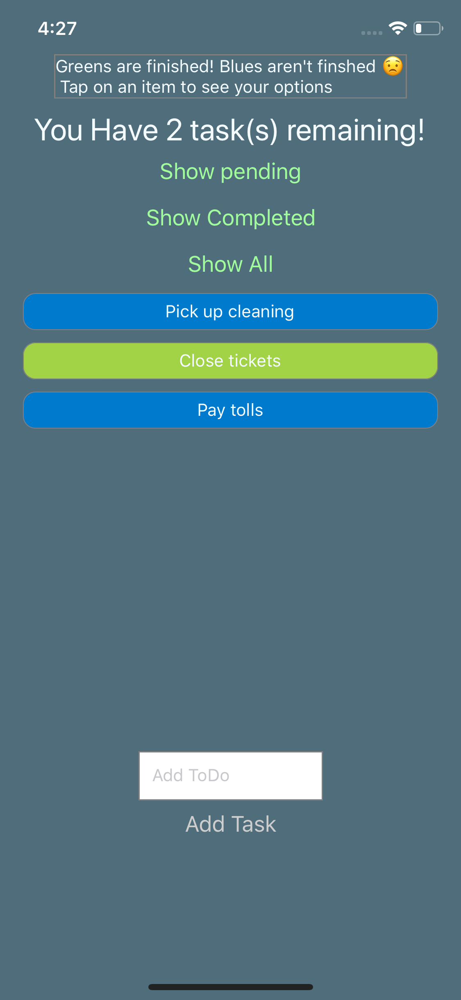

#ToDo App
A basic CRUD ToDo app that also saves data to device storage


### Run This App
#### Ensure you have all dependencies installed:
```
$ brew install node
$ brew install npm
$ brew install watchman
``` 
Ensure that you have xCode installed, you can get xCode from the MacOS App Store
Install React Native and the React Native CLI
```
$ npm install react-native
$ npm install react
$ npm install -g react-native-cli
```                                                         
#### Run the app
clone this repo: 
```
$ git clone https://github.com/thecmcdowell/Todo_RN
```
Change into project directory (eg Todo_rn) and initialize node for the app:
```
$ cd Todo_run
$ npm install
```
Build and run the app on the iOS simulator: 
```
react-native run-ios
```
